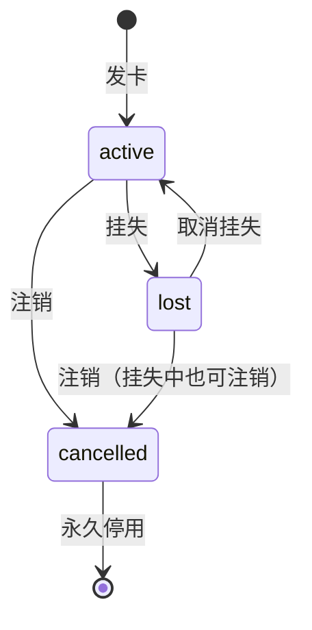

# cards（饭卡）

## 作用
- 系统核心表，记录每张饭卡的状态、余额和押金

## 设计原因
- ID 即卡号，自增生成，满足"自动产生编号"需求
- 每次发卡都创建新记录，不重用旧卡号，注销的卡保留为历史记录
- CardHolderID 为必填，发卡时关联持卡人
- 金额字段用 int64 存分，避免浮点精度问题
- Status 用字符串枚举，方便阅读和调试

## 字段
- ID:
  - 含义: 卡号（自动编号）
  - 类型: uint
  - 是否必填: 自动生成
  - 默认值: 自增
- CardHolderID:
  - 含义: 持卡人
  - 类型: uint
  - 是否必填: 是
  - 默认值: 无
  - 备注: 发卡时关联持卡人，不可变
- Deposit:
  - 含义: 押金
  - 类型: int64
  - 是否必填: 是
  - 默认值: 0
  - 备注: 单位：分
- Balance:
  - 含义: 卡内余额
  - 类型: int64
  - 是否必填: 是
  - 默认值: 0
  - 备注: 单位：分
- Status:
  - 含义: 卡状态
  - 类型: string (CardStatus)
  - 是否必填: 是
  - 默认值: "active"
  - 备注: active=正常 / lost=挂失 / cancelled=已注销
- CreatedAt:
  - 含义: 发卡时间
  - 类型: time.Time
  - 是否必填: GORM 自动填充
  - 默认值: 当前时间
- UpdatedAt:
  - 含义: 最后更新时间
  - 类型: time.Time
  - 是否必填: GORM 自动填充
  - 默认值: 当前时间

## 主键 / 索引 / 约束
- 主键: ID
- NOT NULL: CardHolderID, Deposit, Balance, Status
- 外键: CardHolderID → card_holders.ID

## 表关系
- 属于 card_holders（多对一，通过 CardHolderID）
- 被 deposit_records 通过 card_id 引用
- 被 transactions 通过 card_id 引用

## 状态流转

