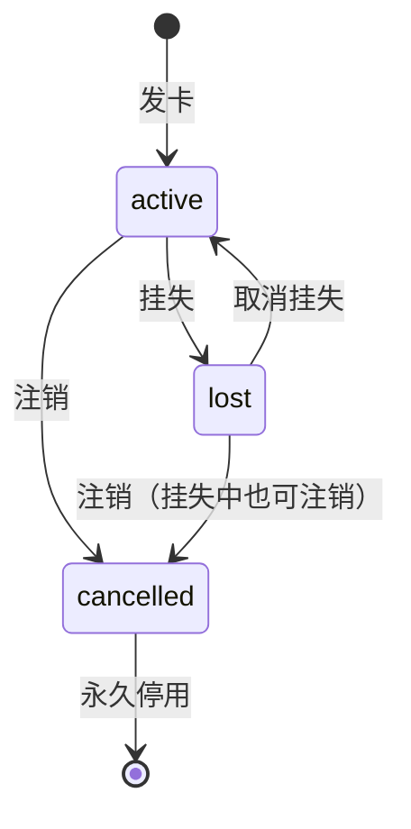

# cards（饭卡）

## 作用
- 系统核心表，记录每张饭卡的状态、余额和押金

## 设计原因
- card_no 为对外业务卡号，16 位随机数字字符串，发卡时生成，不重用
- ID 为数据库内部自增主键，仅用于 deposit_records、transactions 的 FK 关联，不对外暴露
- 原设计直接以 ID 作为卡号，因 ID 太短（1位起步）且语义耦合，改为独立的 card_no 字段
- CardHolderID 为必填，发卡时关联持卡人
- 金额字段用 int64 存分，避免浮点精度问题
- Deposit 固定写入 2000 分（20元），不由操作员决定，但仍存储以便注销时退款
- Status 用字符串枚举，方便阅读和调试

## 变更内容
- **新增字段 CardNo**：16 位数字字符串，unique，not null，取代 ID 作为对外卡号标识
- **ID 语义调整**：由原来的"卡号"变更为"内部自增主键"，不再对外暴露
- **Deposit 语义明确**：值固定为 2000 分，由系统写入，操作员无法修改

## 迁移注意事项
- 已有数据（开发阶段）需补充 card_no 值，或直接清库重建（课设允许 break change）
- card_no 需加 UNIQUE 索引

## 字段
- ID:
  - 含义: 内部自增主键，仅用于表关联（FK），不对外暴露
  - 类型: uint
  - 是否必填: 自动生成
  - 默认值: 自增
- CardNo:
  - 含义: 业务卡号，对外唯一标识，所有 API 路径参数使用此字段
  - 类型: string
  - 是否必填: 是
  - 默认值: 发卡时系统生成
  - 备注: 16 位随机数字字符串，不重用，不可变
- CardHolderID:
  - 含义: 持卡人
  - 类型: uint
  - 是否必填: 是
  - 默认值: 无
  - 备注: 发卡时关联持卡人，不可变
- Deposit:
  - 含义: 押金
  - 类型: int64
  - 是否必填: 是
  - 默认值: 2000
  - 备注: 单位分，固定值 2000（20元），由系统写入，不可由操作员调整，注销时按此值退款
- Balance:
  - 含义: 卡内余额
  - 类型: int64
  - 是否必填: 是
  - 默认值: 0
  - 备注: 单位：分
- Status:
  - 含义: 卡状态
  - 类型: string (CardStatus)
  - 是否必填: 是
  - 默认值: "active"
  - 备注: active=正常 / lost=挂失 / cancelled=已注销
- CreatedAt:
  - 含义: 发卡时间
  - 类型: time.Time
  - 是否必填: GORM 自动填充
  - 默认值: 当前时间
- UpdatedAt:
  - 含义: 最后更新时间
  - 类型: time.Time
  - 是否必填: GORM 自动填充
  - 默认值: 当前时间

## 主键 / 索引 / 约束
- 主键: ID
- UNIQUE 索引: CardNo
- NOT NULL: CardNo, CardHolderID, Deposit, Balance, Status
- 外键: CardHolderID → card_holders.ID

## 表关系
- 属于 card_holders（多对一，通过 CardHolderID）
- 被 deposit_records 通过 card_id 引用
- 被 transactions 通过 card_id 引用

## 状态流转

