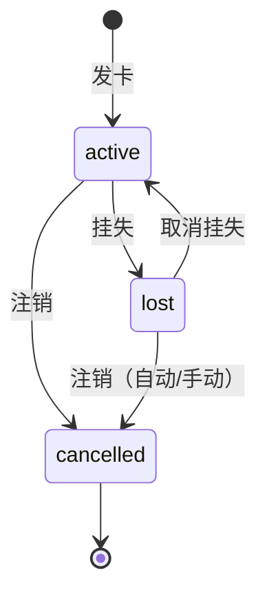

# card_service 核心业务模块

## 作用
- 管理饭卡全生命周期：发卡、存款、就餐消费、挂失、取消挂失、注销

## 职责边界
- 负责：业务规则校验、卡状态流转、跨实体协调（卡+持卡人）、业务错误定义
- 不负责：HTTP 参数解析、数据库 SQL、统计聚合

## 卡状态流转

---

## IssueCard（发卡）

### 输入
- name（姓名）、idNumber（证件号）、deposit（押金，必须 > 0）、preDeposit（预存款，必须 >= 0）

### 输出
- IssueCardResult：新卡、持卡人、可选的旧卡退款信息（OldCardRefund）

### 核心流程
1. 参数校验（押金 > 0，预存款 >= 0，姓名/证件号非空）
2. 按 idNumber 查找持卡人，不存在则创建
3. 查找该持卡人名下 active 卡 → 存在则返回 CARD_ALREADY_ACTIVE
4. 查找该持卡人名下 lost 卡 → 存在则自动注销（status=cancelled, balance=0），记录 OldCardRefund
5. 创建新卡（status=active, balance=preDeposit, deposit=deposit）

### 异常处理
- CARD_ALREADY_ACTIVE（409）：同证件号已有有效卡，拒绝重复发卡
- 若有 lost 卡：不拒绝，自动注销旧卡并附上退款信息

### 关键实现点
- 持卡人以 idNumber 唯一，多次发卡复用同一 CardHolder 记录
- 旧卡自动注销时 balance 清零，deposit 保留在 OldCardRefund 中返回

---

## Deposit（存款）

### 输入
- cardID、amount（> 0）

### 输出
- DepositResult：存款记录 ID、卡 ID、持卡人姓名、充值金额、充值后余额、时间戳

### 核心流程
1. amount > 0 校验
2. 查询卡片（不存在返回 CARD_NOT_FOUND）
3. status 校验：只允许 active，lost/cancelled 均返回 CARD_NOT_ACTIVE
4. balance += amount，保存卡片
5. 创建 DepositRecord
6. 返回收据信息

### 异常处理
- CARD_NOT_FOUND（404）
- CARD_NOT_ACTIVE（409）：lost 卡提示"已挂失，无法充值"；cancelled 卡提示"已注销，无法充值"

---

## CreateTransaction（就餐消费）

### 输入
- cardID、windowID、amount（> 0）

### 输出
- TransactionResult：消费记录 ID、卡 ID、窗口 ID、消费金额、消费后余额、时间戳

### 核心流程（三重校验顺序严格）
1. amount > 0 校验
2. 卡存在校验（CARD_NOT_FOUND，消息："此卡非本单位所发"）
3. 非 cancelled 校验（CARD_CANCELLED，消息："此卡已注销"）
4. 非 lost 校验（CARD_LOST，消息："此卡已挂失"）
5. 余额充足校验（INSUFFICIENT_BALANCE）
6. 窗口存在校验（WINDOW_NOT_FOUND）
7. balance -= amount，保存卡片，创建 Transaction 记录

### 关键实现点
- cancelled 先于 lost 校验（已注销优先报警）
- 窗口校验在余额校验之后，非关键路径

---

## ReportLoss（挂失）

### 输入
- cardID

### 输出
- 更新后的 Card 对象

### 核心流程
1. 查卡（CARD_NOT_FOUND）
2. status 必须为 active（否则 CARD_NOT_ACTIVE）
3. status = lost，保存

---

## CancelLossReport（取消挂失）

### 输入
- cardID

### 输出
- 更新后的 Card 对象

### 核心流程
1. 查卡（CARD_NOT_FOUND）
2. status 必须为 lost（否则 CARD_NOT_LOST）
3. status = active，保存

---

## CancelCard（注销）

### 输入
- cardID

### 输出
- CancellationResult：卡信息、退还押金、退还余额（注销前）、合计

### 核心流程
1. 查卡（CARD_NOT_FOUND）
2. status 已为 cancelled 则返回 CARD_ALREADY_CANCELLED
3. 记录 deposit 和 balance（注销前）
4. status = cancelled，balance = 0，保存
5. 返回退款合计（deposit + 注销前 balance）

### 关键实现点
- active 和 lost 均可直接注销，不区分
- balance 在 CancellationResult 中反映注销前余额，保存后卡上 balance 为 0
