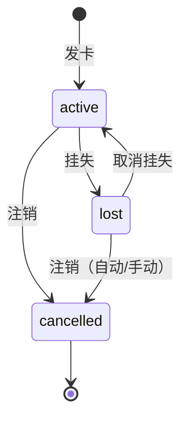

# card_service 核心业务模块

## 作用
- 管理饭卡全生命周期：发卡、存款、就餐消费、挂失、取消挂失、注销
- 按证件号查询当前有效卡（GetCurrentCardByIDNumber）
- 消费/存款历史查询（GetCardTransactions / GetCardDeposits）

## 职责边界
- 负责：业务规则校验、卡状态流转、跨实体协调（卡+持卡人）、业务错误定义、调用学籍验证接口、数据库事务管理、消费限额校验
- 不负责：HTTP 参数解析、数据库 SQL 细节、统计聚合、学籍验证的底层实现

## 事务化策略

IssueCard、Deposit、CreateTransaction 三个涉及多步写操作的方法使用 `gorm.DB.Transaction` 包裹：
- 事务内通过 `CardRepository.WithTx(tx)` 创建临时 repo 实例，确保所有读写在同一事务中执行
- 学籍验证（外部 HTTP 调用）放在事务外，避免长事务
- 窗口存在性校验（只读）也放在事务外
- 事务内任何一步失败自动 rollback

ReportLoss、CancelLossReport、CancelCard 为单条记录更新，无需事务包裹

## 卡状态流转

---

## IssueCard（发卡）

### 输入
- idNumber（证件号，12位）、preDeposit（预存款，必须 >= 0）
- 押金不由调用方传入，系统常量 DEPOSIT_AMOUNT = 2000 分

### 输出
- IssueCardResult：新卡、持卡人、可选的旧卡退款信息（OldCardRefund）

### 核心流程
1. 参数校验（预存款 >= 0，证件号非空）
2. 调用 StudentValidator.Validate(idNumber)，失败返回 STUDENT_NOT_FOUND
3. 按 idNumber 查找持卡人，不存在则用验证结果中的姓名创建
4. 查找该持卡人名下 active 卡 → 存在则返回 CARD_ALREADY_ACTIVE
5. 查找该持卡人名下 lost 卡 → 存在则自动注销（status=cancelled, balance=0），记录 OldCardRefund
6. 生成 16 位随机数字卡号（card_no），创建新卡（status=active, balance=preDeposit, deposit=DEPOSIT_AMOUNT）

### 异常处理
- STUDENT_NOT_FOUND（404）：证件号不在学籍库，拒绝发卡
- CARD_ALREADY_ACTIVE（409）：同证件号已有有效卡，拒绝重复发卡
- 若有 lost 卡：不拒绝，自动注销旧卡并附上退款信息

### 关键实现点
- 持卡人姓名来自学籍验证结果，不由操作员录入
- 持卡人以 idNumber 唯一，多次发卡复用同一 CardHolder 记录
- 旧卡自动注销时 balance 清零，deposit 保留在 OldCardRefund 中返回
- 整个流程在事务内执行，学籍验证在事务外（避免长事务锁）
- preDeposit > 0 时在事务内同步创建 DepositRecord 流水

---

## Deposit（存款）

### 输入
- cardNo（16位卡号）、amount（> 0）

### 输出
- DepositResult：存款记录 ID、卡 ID、持卡人姓名、充值金额、充值后余额、时间戳

### 核心流程
1. amount > 0 校验
2. 查询卡片（不存在返回 CARD_NOT_FOUND）
3. status 校验：只允许 active，lost/cancelled 均返回 CARD_NOT_ACTIVE
4. balance += amount，保存卡片
5. 创建 DepositRecord
6. 返回收据信息

### 异常处理
- CARD_NOT_FOUND（404）
- CARD_NOT_ACTIVE（409）：lost 卡提示"已挂失，无法充值"；cancelled 卡提示"已注销，无法充值"

---

## CreateTransaction（就餐消费）

### 输入
- cardNo（16位卡号）、windowID、amount（> 0）

### 输出
- TransactionResult：消费记录 ID、卡 ID、窗口 ID、消费金额、消费后余额、时间戳

### 核心流程（三重校验 + 限额校验）
1. amount > 0 校验
2. 单笔限额校验：amount ≤ 20000 分（200 元），超限返回 EXCEED_SINGLE_LIMIT
3. 窗口存在校验（WINDOW_NOT_FOUND）— 事务外
4. 卡存在校验（CARD_NOT_FOUND，消息："此卡非本单位所发"）
5. 非 cancelled 校验（CARD_CANCELLED，消息："此卡已注销"）
6. 非 lost 校验（CARD_LOST，消息："此卡已挂失"）
7. 日累计限额校验：今日已消费 + 本次 ≤ 50000 分（500 元），超限返回 EXCEED_DAILY_LIMIT
8. 余额充足校验（INSUFFICIENT_BALANCE）
9. balance -= amount，保存卡片，创建 Transaction 记录

### 关键实现点
- cancelled 先于 lost 校验（已注销优先报警）
- 单笔限额在事务外校验（纯数值比较）
- 日累计限额在事务内校验（需查当天消费 SUM，保证一致性）
- 窗口存在性校验在事务外执行（只读，不需要事务保护）
- 卡片余额扣减和消费记录创建在同一事务内，保证原子性

---

## GetCardTransactions（消费历史查询）

### 输入
- cardNo（16位卡号）、page、pageSize

### 输出
- CardTransactionsResult：消费记录列表（含窗口名）、总数、页码

### 核心流程
1. 按 cardNo 查卡（CARD_NOT_FOUND）
2. 按 card.ID 查消费记录，JOIN windows 获取窗口名
3. 按 created_at DESC 排序，LIMIT/OFFSET 分页

---

## GetCardDeposits（存款历史查询）

### 输入
- cardNo（16位卡号）、page、pageSize

### 输出
- CardDepositsResult：存款记录列表、总数、页码

### 核心流程
1. 按 cardNo 查卡（CARD_NOT_FOUND）
2. 复用 GetHolderDeposits 按 holderID 查存款记录分页

---

## ReportLoss（挂失）

### 输入
- cardNo（16位卡号，由前端先按证件号查卡后得到）

### 输出
- 更新后的 Card 对象

### 核心流程
1. 查卡（CARD_NOT_FOUND）
2. status 必须为 active（否则 CARD_NOT_ACTIVE）
3. status = lost，保存

---

## CancelLossReport（取消挂失）

### 输入
- cardNo（16位卡号，由前端先按证件号查卡后得到）

### 输出
- 更新后的 Card 对象

### 核心流程
1. 查卡（CARD_NOT_FOUND）
2. status 必须为 lost（否则 CARD_NOT_LOST）
3. status = active，保存

---

## CancelCard（注销）

### 输入
- cardNo（16位卡号，由前端先按证件号查卡后得到）

### 输出
- CancellationResult：卡信息、退还押金、退还余额（注销前）、合计

### 核心流程
1. 查卡（CARD_NOT_FOUND）
2. status 已为 cancelled 则返回 CARD_ALREADY_CANCELLED
3. 记录 deposit 和 balance（注销前）
4. status = cancelled，balance = 0，保存
5. 返回退款合计（deposit + 注销前 balance）

### 关键实现点
- active 和 lost 均可直接注销，不区分
- balance 在 CancellationResult 中反映注销前余额，保存后卡上 balance 为 0

---

## GetCurrentCardByIDNumber（按证件号查卡）

### 输入
- idNumber（证件号）

### 输出
- 当前有效卡（active 或 lost），含 CardHolder 预加载

### 核心流程
1. 通过 JOIN card_holders 按 id_number 匹配
2. 排除 cancelled 状态的卡
3. 按 created_at DESC 取最新一张

### 异常处理
- CARD_NOT_FOUND（404）：该证件号无有效卡（所有卡都已注销或从未办卡）

### 关键实现点
- 该方法从 handler 层下沉到 service 层，使 handler 不直接依赖 repository
- 前端挂失/注销页面以证件号为入口，先调此方法获得 cardNo 再操作
