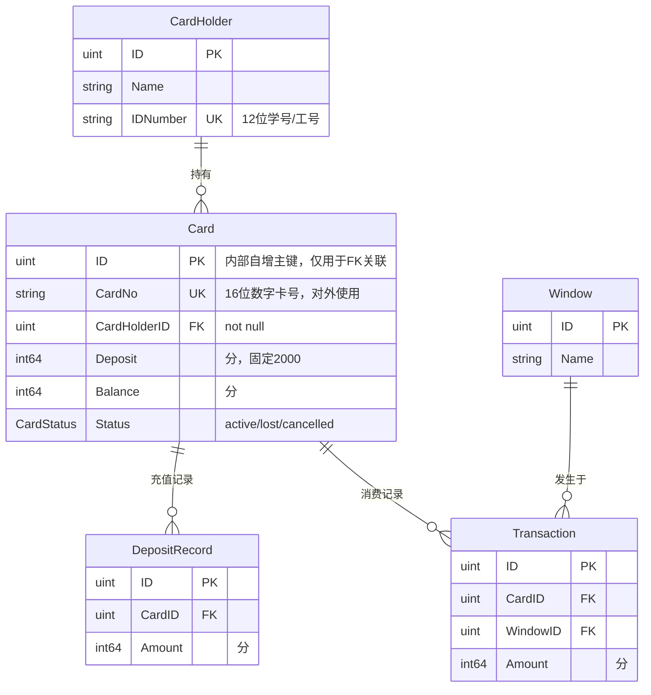

# 架构与关键约束

## 系统目标

食堂饭卡管理系统，支持 6 项核心业务：发卡、存款、就餐消费、汇总统计、挂失、注销。课设项目，不投入生产。

## 模块边界

```
meal-card/                    ← mono repo
├── frontend/                 ← React SPA（管理端 + 窗口机模拟）
├── backend/                  ← Go HTTP API（:8080）
│   └── client/               ← 学籍验证实现（内嵌 Mock，无需外部服务）
└── docs/                     ← 全局文档
    └── api/                  ← OpenAPI 契约（yaml）
```

前后端通过 RESTful API 通信，接口契约以 `docs/api/` 下的 OpenAPI yaml 为准，双方严格遵照。

前端开发时通过 Vite 代理 `/api` 到后端 `:8080`，api.js 使用相对路径。

学籍验证数据内嵌在后端 `client/student_client.go` 的 `MockStudentValidator` 中，无需启动外部服务。

## 技术选型

| 层 | 选型 | 理由 |
|---|---|---|
| 后端语言 | Go 1.26 | 课设指定 |
| ORM | GORM + `github.com/glebarez/sqlite` | 纯 Go SQLite 驱动，无 CGO 依赖 |
| 数据库 | SQLite | 单文件，零部署成本，课设够用 |
| 日志 | zerolog | 结构化日志 |
| 后端架构 | 三层（handler → service → repository） | AGENTS.md 约定，不做过多设计 |
| Web 框架 | Echo v4 | 轻量高性能 |
| 前端框架 | React 18 + Vite | 课设指定 |
| UI 组件库 | Ant Design 6 | 开箱即用 |
| 前端包管理 | pnpm | AGENTS.md 约定 |
| 学籍验证 | 内嵌 Mock | 硬编码学生/教职工名单，实现 StudentValidator 接口 |

## 数据模型

5 张表，详见 `backend/docs/database/`。



## 关键约束

1. **金额单位**：所有金额字段用 `int64` 存储，单位为分
2. **接口契约优先**：所有 API 必须先在 OpenAPI yaml 中定义，前后端严格遵照
3. **每次发卡新建记录**：不重用旧卡号，注销的卡保留为历史记录
4. **一人一卡**：同一证件号只能持有一张 active 状态的卡；有 lost 卡时可办新卡，旧卡自动注销
5. **只做基本需求**：不做任何拓展和额外设计
6. **绘图用 mermaid**：文档中的图表统一使用 mermaid
7. **卡号格式**：16 位随机数字字符串（card_no 字段），独立于数据库自增 ID，对外所有接口均使用 card_no 而非 DB id
8. **押金固定**：押金统一为 20 元（2000 分），系统常量，不由操作员录入
9. **发卡前须验证证件号**：调用学籍验证服务，证件号无效则拒绝发卡
10. **挂失/注销以证件号为入口**：操作员输入证件号，系统查找对应卡，再执行操作

## 学籍验证服务集成

### 接口定义（`backend/service/`）

`StudentValidator` interface 定义在 service 层，`CardService` 依赖此接口，不感知底层实现：

```go
// StudentInfo 学籍验证结果
type StudentInfo struct {
    IDNumber string
    Name     string
    Type     string // "student" | "staff"
}

// StudentValidator 学籍验证接口，由 CardService 依赖
type StudentValidator interface {
    Validate(idNumber string) (*StudentInfo, error)
}
```

### 实现

| 实现 | 位置 | 用途 |
|---|---|---|
| `MockStudentValidator` | `backend/client/student_client.go` | 内嵌硬编码学籍数据，开发/演示/测试通用 |
| `FakeStudentValidator` | `backend/service/card_service_test.go` | 单元测试，硬编码返回 |

`MockStudentValidator` 内置 8 条记录（5 名学生 + 3 名教职工），无需启动外部服务。

## 事务策略

IssueCard、Deposit、CreateTransaction 使用 `gorm.DB.Transaction` 保证原子性。事务内通过 `CardRepository.WithTx(tx)` 获取临时仓库实例。外部调用（学籍验证）和只读查询（窗口校验）放在事务外。

## 关键数据流

### 发卡
1. 前端调 `GET /api/validate-student?idNumber=xxx` → 后端调学籍服务 → 返回姓名和人员类型
2. 前端展示，操作员确认
3. 前端调 `POST /api/cards`（含证件号、预存款）→ 后端再次调学籍服务校验 → 创建 CardHolder（已有则复用）→ 生成 16 位 card_no → 创建 Card（押金固定 2000 分）

### 存款
1. 操作员输入卡号（card_no）→ `GET /api/cards/{cardNo}` 展示卡信息
2. 输入充值金额 → `POST /api/cards/{cardNo}/deposits` 结算

### 就餐消费
1. 输入卡号（card_no）→ 三重校验：卡号存在（本单位）、状态非 cancelled（有效）、状态非 lost（未挂失）
2. 校验通过 → 显示余额 → 工作人员输入消费金额
3. 确认结算 → 校验余额充足 → 扣款 → 创建 Transaction → 显示新余额

### 挂失/注销
1. 操作员输入证件号 → `GET /api/cards?idNumber=xxx` → 返回该证件号当前有效卡（active 或 lost）
2. 前端展示卡信息，操作员确认
3. 挂失：`PUT /api/cards/{cardNo}/loss-report`；取消挂失：`DELETE /api/cards/{cardNo}/loss-report`；注销：`POST /api/cards/{cardNo}/cancellation`
