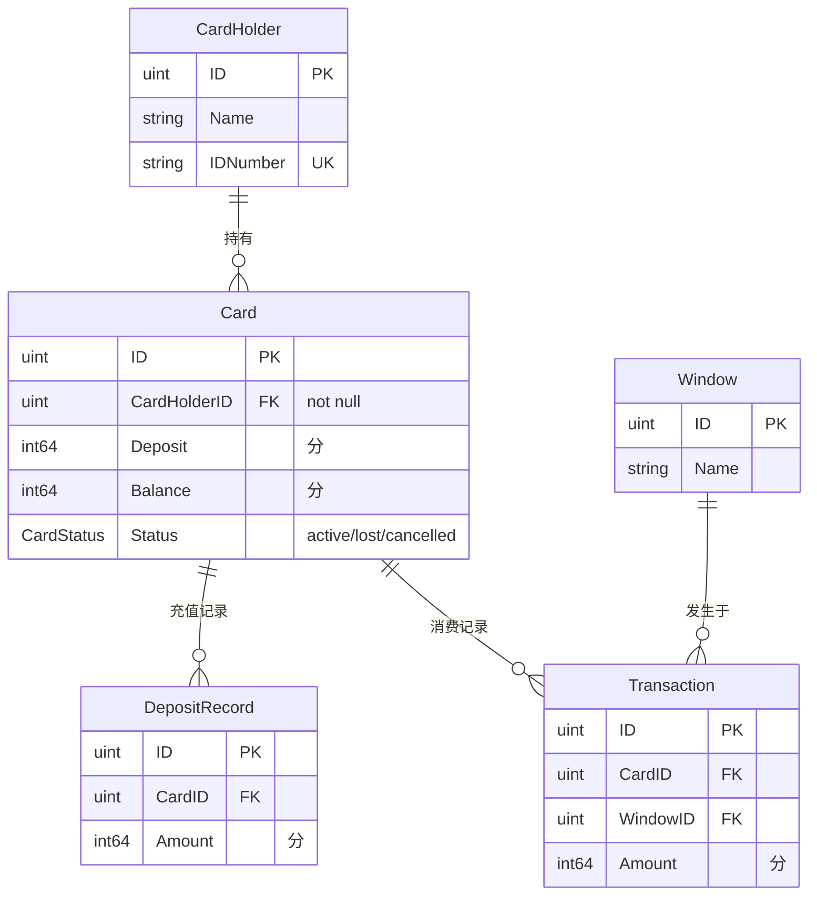

# 架构与关键约束

## 系统目标

食堂饭卡管理系统，支持 6 项核心业务：发卡、存款、就餐消费、汇总统计、挂失、注销。课设项目，不投入生产。

## 模块边界

```
meal-card/                  ← mono repo
├── frontend/               ← React SPA（管理端 + 窗口机模拟）
├── backend/                ← Go HTTP API
├── docs/                   ← 全局文档
│   └── api/                ← OpenAPI 契约（yaml）
└── Makefile
```

前后端通过 RESTful API 通信，接口契约以 `docs/api/` 下的 OpenAPI yaml 为准，双方严格遵照。

## 技术选型

| 层 | 选型 | 理由 |
|---|---|---|
| 后端语言 | Go 1.26 | 课设指定 |
| ORM | GORM + `github.com/glebarez/sqlite` | 纯 Go SQLite 驱动，无 CGO 依赖 |
| 数据库 | SQLite | 单文件，零部署成本，课设够用 |
| 日志 | zerolog | 结构化日志 |
| 后端架构 | 三层（handler → service → repository） | AGENTS.md 约定，不做过多设计 |
| 前端框架 | React | 课设指定 |
| 前端包管理 | pnpm | AGENTS.md 约定 |

## 数据模型

5 张表，详见 `backend/docs/database/`。



## 关键约束

1. **金额单位**：所有金额字段用 `int64` 存储，单位为分
2. **接口契约优先**：所有 API 必须先在 OpenAPI yaml 中定义，前后端严格遵照
3. **每次发卡新建记录**：不重用旧卡号，注销的卡保留为历史记录
4. **一人一卡**：同一证件号只能持有一张 active 状态的卡；有 lost 卡时可办新卡，旧卡自动注销
5. **只做基本需求**：不做任何拓展和额外设计
6. **绘图用 mermaid**：文档中的图表统一使用 mermaid

## 关键数据流

### 发卡
1. 登记持卡人信息 → 创建 CardHolder（已有则复用）
2. 创建新 Card → 关联 CardHolderID，记录押金，预存金额

### 就餐消费
1. 输入卡号 → 三重校验：卡号存在（本单位）、状态非 cancelled（有效）、状态非 lost（未挂失）
2. 校验通过 → 显示余额 → 工作人员输入消费金额
3. 确认结算 → 校验余额充足 → 扣款 → 创建 Transaction → 显示新余额

### 挂失/取消挂失
1. 挂失：Card.Status active → lost
2. 取消挂失：Card.Status lost → active
3. 窗口机消费时校验状态即可拦截

### 注销
1. Card.Status → cancelled，余额清零
2. 退还押金 + 剩余余额
